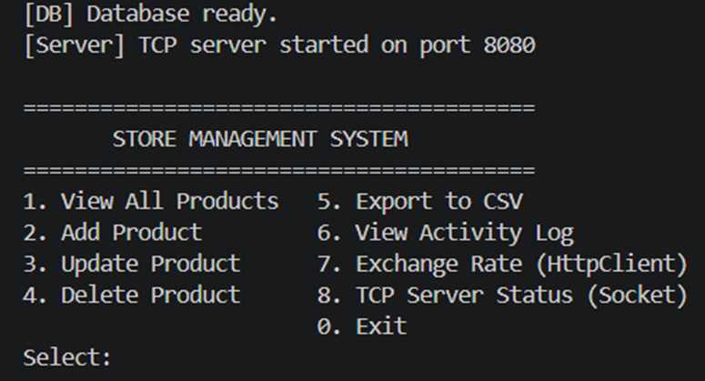
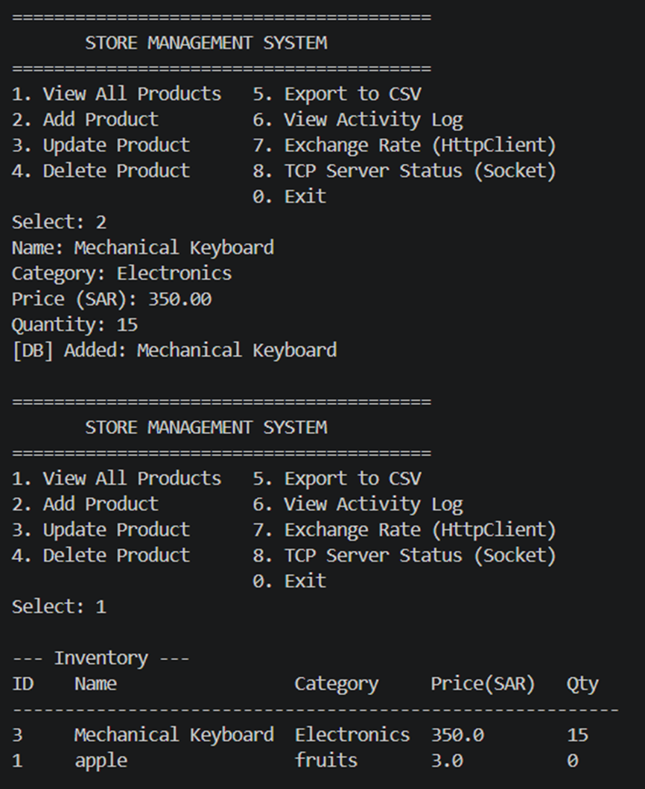
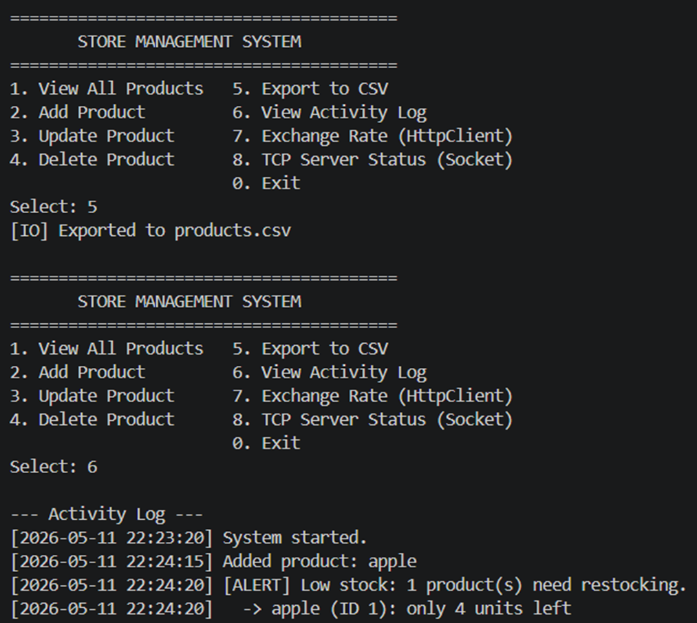
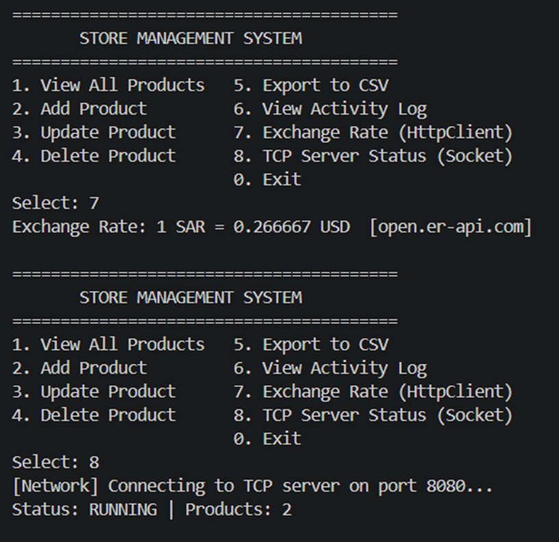

# Store Management System

A Java CLI application for managing store inventory and sales, built as a course final project demonstrating IO Streams, Multi-threading, Networking, and Database integration.

---

## Features

| Feature | Description |
|---|---|
| Product CRUD | Add, view, update, and delete products with name, category, price, and stock quantity |
| Sales Recording | Record sales with automatic stock deduction and insufficient-stock guard |
| Low Stock Alerts | Background thread checks inventory every 30 s and alerts when quantity falls below 5 |
| CSV Export | Export products and sales history to `.csv` files |
| CSV Import | Bulk-import products from a CSV file |
| Activity Log | All key actions are timestamped and written to `activity.log` |
| HTTP Server | Embedded HTTP server exposes `/api/status` and `/api/inventory` as JSON endpoints |
| Exchange Rate | Fetches live SAR → USD rate from the Frankfurter public API |

---

## Technical Requirements Coverage

### IO Streams
- `ReportService.exportProductsCSV()` / `exportSalesCSV()` — `BufferedWriter` to file
- `ReportService.importProductsCSV()` — `BufferedReader` from file
- `ReportService.appendToLog()` — `FileWriter` in append mode for timestamped logging
- `ReportService.displayLog()` — reads and prints `activity.log`

### Multi-threading
- **`InventoryMonitor`** — implements `Runnable`, started as a daemon thread; sleeps 30 s between checks
- **`NetworkService.startServer()`** — starts the HTTP server on a named background thread; uses a fixed `ExecutorService` thread pool (4 threads) to handle concurrent HTTP requests
- **Synchronization** — all write operations in `DatabaseHandler` (`addProduct`, `updateProduct`, `deleteProduct`, `recordSale`) are `synchronized` on the instance to prevent race conditions between the main thread and the monitor thread; `ReportService.appendToLog()` is `synchronized` to prevent interleaved log lines

### Networking
- **`NetworkService.startServer(int port, DatabaseHandler db)`** — embedded HTTP server using `com.sun.net.httpserver.HttpServer` (built into the JDK):
  - `GET /api/status` → `{"status":"running","port":8080}`
  - `GET /api/inventory` → JSON array of all products
- **`NetworkService.fetchExchangeRate()`** — uses `java.net.http.HttpClient` (Java 11) to send a GET request to `https://api.frankfurter.app/latest?from=SAR&to=USD` and parse the response

### Database
- **SQLite** via `org.xerial:sqlite-jdbc`
- **Schema**:
  ```sql
  products (id PK, name, category, price REAL, quantity INTEGER)
  sales    (id PK, product_id FK, quantity_sold, unit_price, total, sale_date TEXT)
  ```
- **CRUD**: full create/read/update/delete on products; insert + JOIN query on sales
- **Transaction** in `recordSale()`: stock check, sale insert, and stock deduction run inside a single `conn.setAutoCommit(false)` / `commit()` / `rollback()` block for atomicity

### Exception Handling & Resource Management
- All `Connection`, `Statement`, `ResultSet`, `BufferedReader`, and `BufferedWriter` objects opened inside `try-with-resources` blocks
- `NumberFormatException` caught for all user numeric input
- `InterruptedException` handled in `InventoryMonitor` with `Thread.currentThread().interrupt()` to restore the interrupted flag

---

## Setup & Running

### Prerequisites
- Java 11 or higher (`java -version`)
- Maven 3.6+ (`mvn -version`)  
  *(If `mvn` is not in PATH, use the full path to your local Maven installation)*

### Build
```bash
cd demo
mvn package -DskipTests
```

### Run
```bash
java -jar target/demo-1.0-SNAPSHOT.jar
```

### Run Tests
```bash
mvn test
```

---

## CSV Import Format

To bulk-import products, create a CSV file with the following header (no ID column):

```
Name,Category,Price,Quantity
Laptop,Electronics,2499.99,15
Coffee,Beverages,45.00,200
```

Then choose **Reports & Export → Import Products from CSV** and enter the filename.

---

## HTTP Server Endpoints

Once the app is running, the embedded server is available at `http://localhost:8080`:

| Endpoint | Method | Response |
|---|---|---|
| `/api/status` | GET | `{"status":"running","port":8080}` |
| `/api/inventory` | GET | JSON array of all products |

---

## Project Structure

```
src/
├── main/java/com/example/
│   ├── App.java              # Entry point, main menu
│   ├── DatabaseHandler.java  # SQLite CRUD (products + sales)
│   ├── NetworkService.java   # HTTP server + HttpClient exchange rate
│   ├── ReportService.java    # CSV export/import, activity log
│   └── InventoryMonitor.java # Background low-stock monitor thread
└── test/java/com/example/
    └── AppTest.java          # JUnit 5 tests (8 test cases)
```

---

## Screenshots

View 1: System Startup & Main Menu




View 2: Database Operations (CRUD)

 


View 3: File IO Streams (Export & Logging)

 


View 4: Networking & Multi-threading

 